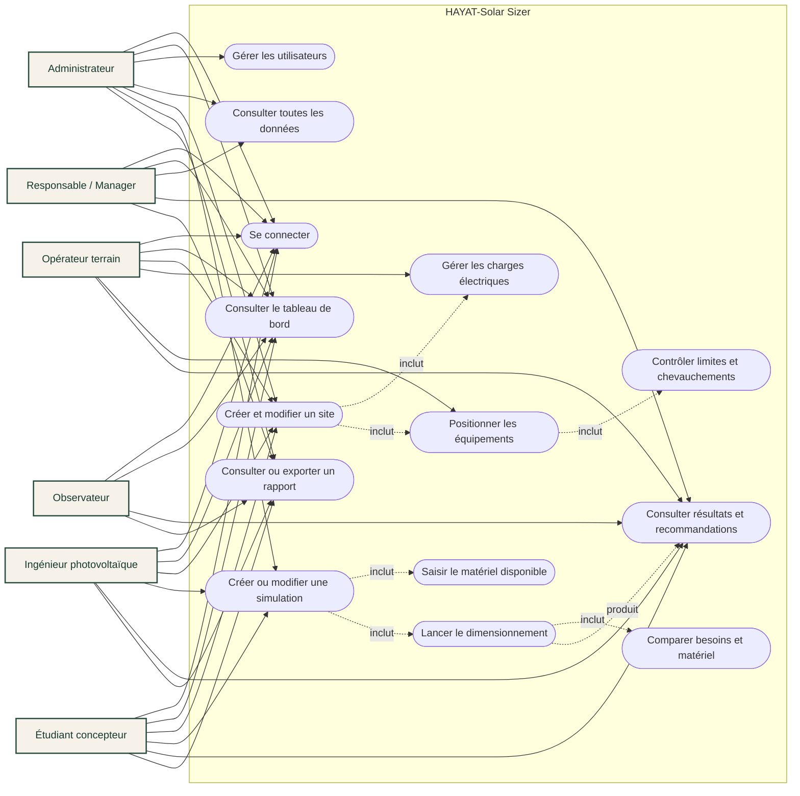

# Diagrammes UML — HAYAT-Solar Sizer

## Diagramme de cas d'utilisation

Les acteurs représentent ici les personnes qui interviennent réellement dans le système.

## Diagramme des classes

Le diagramme contient les entités persistantes et les services qui portent les opérations métier.

```mermaid
classDiagram
    direction LR

    class Utilisateur {
        +entier identifiant
        +chaine nom_complet
        +chaine courriel
        +chaine mot_de_passe_hache
        +RoleUtilisateur role
        +dateHeure date_creation
        +dateHeure date_modification
        +possedeRole(role) booleen
        +peutGererSites() booleen
        +peutGererSimulations() booleen
    }

    class Client {
        +entier identifiant
        +entier identifiant_utilisateur
        +chaine nom
        +chaine organisation
        +chaine telephone
        +chaine courriel
        +chaine adresse
        +chaine notes
        +dateHeure date_creation
        +dateHeure date_modification
        +modifierCoordonnees(telephone, courriel, adresse)
    }

    class Site {
        +entier identifiant
        +entier identifiant_utilisateur
        +chaine nom
        +chaine ville
        +chaine pays
        +chaine type_site
        +chaine description
        +reel latitude
        +reel longitude
        +reel heures_fonctionnement_jour
        +reel jours_autonomie
        +reel heures_secours_cibles
        +reel heures_ensoleillement
        +reel rendement_systeme
        +entier tension_systeme
        +reel surface_totale_m2
        +reel surface_pylone_m2
        +reel surface_baie_m2
        +reel surface_groupe_m2
        +reel autre_surface_bloquee_m2
        +reel surface_utile_m2
        +reel ratio_surface_exploitable
        +reel longueur_implantation_m
        +reel largeur_implantation_m
        +booleen snel_disponible
        +booleen groupe_disponible
        +booleen scenario_panne_groupe
        +dateHeure date_creation
        +dateHeure date_modification
        +calculerSurfaceUtile() reel
        +contient(x, y, longueur, largeur) booleen
        +modifierImplantation(longueur, largeur)
    }

    class Equipement {
        +entier identifiant
        +entier identifiant_site
        +chaine nom
        +chaine categorie
        +reel puissance_watts
        +entier quantite
        +reel heures_par_jour
        +booleen critique
        +chaine notes
        +reel position_x_m
        +reel position_y_m
        +reel longueur_occupee_m
        +reel largeur_occupee_m
        +dateHeure date_creation
        +dateHeure date_modification
        +calculerEnergieJournaliere() reel
        +calculerSurfaceOccupee() reel
        +chevauche(autre_equipement) booleen
        +deplacerVers(x, y)
    }

    class Simulation {
        +entier identifiant
        +entier identifiant_utilisateur
        +entier identifiant_site
        +reel puissance_active_critique_w
        +reel duree_secours_h
        +reel facteur_puissance
        +reel puissance_climatiseur_w
        +booleen climatiseur_critique
        +reel autres_charges_critiques_w
        +reel autres_charges_non_critiques_w
        +reel puissance_panneau_w
        +chaine type_panneau
        +reel longueur_panneau_m
        +reel largeur_panneau_m
        +reel surface_panneau_m2
        +reel facteur_espacement_panneaux
        +entier nombre_panneaux_disponibles
        +reel capacite_batterie_ah
        +reel tension_batterie_v
        +chaine type_batterie
        +reel energie_batterie_kwh
        +entier nombre_batteries_disponibles
        +reel puissance_onduleur_disponible_w
        +entier nombre_regulateurs_disponibles
        +reel courant_regulateur_disponible_a
        +entier nombre_parafoudres_dc
        +entier nombre_parafoudres_ac
        +entier nombre_kits_terre
        +reel profondeur_decharge_batterie
        +reel rendement_batterie
        +reel rendement_regulateur
        +reel rendement_onduleur
        +reel facteur_pertes_cables
        +reel longueur_cable_dc_m
        +reel longueur_cable_ac_m
        +reel chute_tension_dc_max_pct
        +reel chute_tension_ac_max_pct
        +reel pertes_temperature
        +reel pertes_poussiere
        +reel facteur_securite
        +booleen protection_foudre_requise
        +booleen parafoudre_dc_requis
        +booleen parafoudre_ac_requis
        +booleen mise_terre_requise
        +reel resistance_terre_cible_ohm
        +reel resistance_terre_mesuree_ohm
        +reel prix_unitaire_panneau
        +reel prix_unitaire_batterie
        +reel prix_onduleur
        +reel prix_regulateur
        +reel prix_climatiseur
        +reel prix_accessoires
        +reel prix_protections
        +reel prix_installation
        +reel prix_main_oeuvre
        +reel prix_maintenance
        +reel cout_exploitation_snel
        +reel cout_exploitation_groupe
        +dateHeure date_creation
        +modifierInventaire(panneaux, batteries, onduleur)
        +modifierParametres(parametres)
    }

    class ResultatSimulation {
        +entier identifiant
        +entier identifiant_simulation
        +reel puissance_totale_w
        +reel puissance_critique_w
        +reel puissance_non_critique_w
        +reel puissance_apparente_va
        +reel energie_journaliere_wh
        +reel energie_critique_wh
        +reel energie_non_critique_wh
        +reel energie_corrigee_wh
        +reel puissance_pv_requise_wc
        +entier nombre_panneaux
        +reel surface_unitaire_panneau_m2
        +reel surface_totale_panneaux_m2
        +reel surface_panneaux_avec_espacement_m2
        +reel surface_panneaux_requise_m2
        +reel surface_requise_avec_espacement_m2
        +reel surface_disponible_m2
        +chaine statut_surface
        +reel capacite_batteries_requise_wh
        +reel capacite_batteries_requise_ah
        +entier nombre_batteries
        +reel autonomie_obtenue_h
        +reel courant_regulateur_a
        +reel puissance_onduleur_w
        +reel section_cable_dc_mm2
        +reel section_cable_ac_mm2
        +reel section_cable_terre_mm2
        +reel calibre_disjoncteur_dc_a
        +reel calibre_disjoncteur_ac_a
        +booleen parafoudre_dc_requis
        +booleen parafoudre_ac_requis
        +booleen protection_foudre_requise
        +booleen mise_terre_requise
        +reel resistance_terre_recommandee_ohm
        +reel resistance_terre_mesuree_ohm
        +chaine statut_mise_terre
        +chaine statut_faisabilite
        +chaine etat_dimensionnement
        +booleen delestage_requis
        +chaine message_delestage
        +chaine avertissements
        +chaine configuration_recommandee
        +reel cout_panneaux
        +reel cout_batteries
        +reel cout_onduleur
        +reel cout_regulateur
        +reel cout_climatiseur
        +reel cout_protections
        +reel cout_installation
        +reel cout_accessoires
        +reel cout_maintenance
        +reel cout_investissement_total
        +reel cout_exploitation_snel
        +reel cout_exploitation_groupe
        +reel cout_total
        +chaine recommandations
        +dateHeure date_creation
        +estFaisable() booleen
        +obtenirComposantsManquants() liste
        +genererResume() chaine
    }

    class ServiceAuthentification {
        -chaine cle_secrete
        -chaine algorithme_chiffrement
        -entier duree_expiration_minutes
        +authentifier(courriel, mot_de_passe) Utilisateur
        +creerJetonAcces(utilisateur) chaine
        +autoriser(utilisateur, permission) booleen
    }

    class ServiceSite {
        -DepotSite depot_sites
        -DepotEquipement depot_equipements
        +creerSite(utilisateur, donnees) Site
        +modifierSite(site, donnees) Site
        +supprimerSite(site)
        +calculerSurfaceUtile(site) reel
        +validerImplantation(site) booleen
    }

    class ServiceEquipement {
        -DepotEquipement depot_equipements
        -ServiceSite service_site
        +ajouterEquipement(site, donnees) Equipement
        +modifierEquipement(equipement, donnees) Equipement
        +supprimerEquipement(equipement)
        +validerPosition(site, equipement) booleen
        +detecterChevauchement(site, equipement) Equipement
    }

    class ServiceSimulation {
        -DepotSimulation depot_simulations
        -ServiceCalcul service_calcul
        +creerSimulation(utilisateur, site, donnees) Simulation
        +modifierSimulation(simulation, donnees) Simulation
        +supprimerSimulation(simulation)
        +calculer(simulation) ResultatSimulation
    }

    class ServiceCalcul {
        -reel rendement_systeme_defaut
        -reel facteur_securite_defaut
        +agregerCharges(equipements) ResumeCharges
        +calculerEnergieJournaliere(equipements) reel
        +dimensionnerPanneaux(simulation, site) entier
        +dimensionnerBatteries(simulation) entier
        +dimensionnerOnduleur(simulation) reel
        +verifierSurface(site, simulation) chaine
        +comparerInventaire(simulation, resultat) PlanInventaire
        +construireRecommandations(resultat) liste
    }

    class ServiceRapport {
        -ServiceCalcul service_calcul
        -chaine format_sortie
        +construireRapport(simulation, resultat) Rapport
        +genererPdf(rapport) octets
    }

    class RoleUtilisateur {
        <<enumeration>>
        administrateur
        responsable
        ingenieur
        operateur
        observateur
        etudiant
    }

    RoleUtilisateur <-- Utilisateur : possede
    Utilisateur "1" --> "0..*" Client : gere
    Utilisateur "1" --> "0..*" Site : possede
    Utilisateur "1" --> "0..*" Simulation : cree
    Site "1" *-- "0..*" Equipement : contient
    Site "1" --> "0..*" Simulation : concerne
    Simulation "1" *-- "0..1" ResultatSimulation : produit

    ServiceAuthentification ..> Utilisateur : authentifie
    ServiceSite ..> Site : gere
    ServiceEquipement ..> Site : verifie
    ServiceEquipement ..> Equipement : gere
    ServiceSimulation ..> Simulation : gere
    ServiceSimulation ..> ServiceCalcul : utilise
    ServiceCalcul ..> Site : analyse
    ServiceCalcul ..> Equipement : agrege
    ServiceCalcul ..> ResultatSimulation : construit
    ServiceRapport ..> Simulation : lit
    ServiceRapport ..> ResultatSimulation : presente
```

## Principales règles métier

- Les acteurs sont reliés uniquement aux actions autorisées par leur rôle.
- Une charge électrique appartient à un site et consomme de l'énergie.
- Le matériel disponible appartient à l'inventaire d'une simulation.
- Un équipement positionné doit rester dans les limites du site.
- Deux équipements positionnés ne peuvent pas se chevaucher.
- Une simulation produit au maximum un résultat de dimensionnement.
